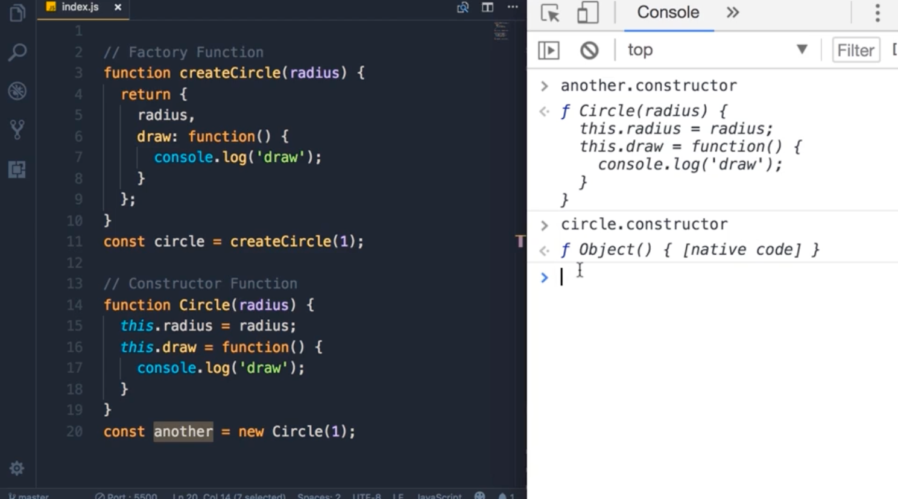

# JavaScript Basics for Beginners

This is the beginning courses from Mosh for javascript, per description:

> An ideal place to start for people who have never programmed with JavaScript or need to refresh the fundamentals.
> https://codewithmosh.com/courses/324741/lectures/5088148

## Note:

I figured it will be worth while to get a solid fundation of javascript.
I will try to finish this fundemental part ASAP. Hope we can get js right the first try. - 10/03/2021

---

### Chapter 1. Basics

#### 1. Variables

```js
let name = "Mosh"; // define variable
```

Naming:

1. avoid reserved keyword.
2. the name shall be meaningful
3. name can NOT start with a number
4. name can NOT contain a space or hyphen
5. prefer to use lower camel `let firstName = "Mosh";`

#### 2. Constant

```js
const interestRate = 0.3;
interestRate = 1; // will give you error.
```

`const` shall be your default choice for anything that you won't change.

#### 3. Primitive Types (Value types)

> String, Number Boolean, undefined, null

notice that:

```js
let firstName = undefined;
typeof firstName; // -> "undefined"

let selectColor = null;
typeof selectColor; // -> "object"
```

ps -> Reference types = [Object, Array, Function]

#### 4. Dynamic Typing

In static language, once a data type is assigned, it can not change `string name = "John"`.

In dynamic language, once a data type is assigned, it could be changed `let name = "John";`.

#### 5. Object

```js
// {} -> object
let person = {
  name: "Mosh",
  age: 30,
};
```

#### 6. Arrays

```js
let colors = ["red", "blue"];
color[2] = 1;
console.log(colors); // ->["red", "blue", 1]
typeof colors; // -> object
```

#### 7. Functions

```js
function greet(firstName, lastName) {
  console.log("Hello " + firstName + " " + lastName);
}

greet("John", "Smith");
```

### Chapter 2. Operators

#### 2. Arithmetic Operators

aka, mathmatical operators, such as `+, -, *, /, %, **, ++, -- `

notice that there's a difference between `++x` and `x++`.

`++x` will increase first, and `x++` will increase after:

```js
let x = 10;
console.log(++x); // 11

let y = 20;
console.log(y++); // 20
```

#### 3. Assignment Operators

`=, +=, -=`

#### 4. Comparison Operators

`>, >=, <, <=, !==, ===`

#### 5. Equality Operators

Strict equality `===` vs. lose equality `==`:
stict: "type" and "value" both are the same.

```js
console.log(1 === 1); // true
console.log("1" === 1); // false
```

lose: convert the type first, and then see whether the value is the same.

```js
console.log(1 == 1); // true
console.log("1" == 1); // true
console.log("1" == true); // true
```

#### 6. Ternary Operator

formula = condition ? (true result) : (false result)

```js
let points = 110;
let type = points > 100 ? "gold" : "silver";
```

#### 7. Logical Operator

`AND, && ` return true if both operands are true.

`OR, ||` return true if one of the operands is true.

#### 8. Logical Operator with Non-booleans

```js
false || "Mosh"; // -> "Mosh"
false || 1; // -> 1
```

"falsy" = `undefined, null, 0, false, '', NaN`
"truthy" = anything that is not "falsy"

"short-circuiting"

```js
false || 1 || 2; // -> 1, it returns as soon as we find a truthy
```

#### 9. Bitwise Operator

In 8-bit system,

1 = 00000001

2 = 00000010

R = `1 | 2` = 00000011 = 3 <- bitwise OR

A = `1 & 2` = 00000000 = 0 <- bitwise AND

### Chapter 3. Control Flow

#### 1. if...else

```js
if (condition) {
  statment
}
else if (another condition) {
  statment
}
else if (yet another condition) {
  statment
}
else
  statment
```

#### 2. switch case

```js
let role;
switch (role) {
  case "guest":
    statment;
    break;
  case "moderator":
    statment;
    break;

  default:
    statment;
}
```

You need the break otherwise it will keep checking.

#### 3. For loop

```js
for (let i = 0; i < 5; i++) {
  console.log("hello world");
}
```

#### 4. while loop

```js
let i = 0;
while (i <= 5) {
  console.log("hellow world");
  i++;
}
```

#### 5. do ... while loop

```js
let i = 0;
do {
  console.log("hello");
  i++;
} while (i <= 5);
```

Difference between while loop and do-while loop: do-while loop will always at least run once.

#### 7. for...in loop

```js
const person = {
  name: "Mosh",
  age: 30,
};

for (let key in person) {
  console.log(key, person[key]);
}
// return:
// name Mosh
// age 30

const colors = ["red", "green", "blue"];
for (let index in colors) {
  console.log(index, colors[index]);
}
// return:
// 0 red
// 1 green
// 2 blue
```

#### 8. for...of loop

```js
const colors = ["red", "green", "blue"];
for (let color of colors) {
  console.log(color);
}
// return:
// red
// green
// blue
```

#### 9. break and continue

```js
let i = 0;
while (i <= 10) {
  if (i === 8) break;
  if (i % 2 === 0) {
    i++;
    continue;
  }
  console.log(i);
  i++;
}
```

`break` = jump out of this whole loop (in this case the while loop).

`continue` = jump to the next iteration.

### Chapter 4. Objects

#### 1. Basics

```js
const circle = {
  radius: 1,
  location: {
    x: 1,
    y: 1,
  },
  isVisible: true,
  draw: function () {
    console.log("draw");
  },
  move: function () {
    console.log("move");
  },
};

circle.draw(); // -> draw
```

#### 2. Factory functions

What if we need more than one circle from last part.

```js
// Factory function
function createCircle(radius) {
  return {
    radius, // === radius: radius
    draw() {
      console.log("draw");
    }, // === draw: function() {...}
  };
}

const circle1 = createCircle(1);
// we only define draw once and only in one place!
```

Camel naming convention: oneTwoThree

#### 3. Constructor functions

Pascale naming convention: OneTwoThree

```js
// Constructor function
function Circle(radius) {
  this.radius = radius;
  this.drwa() = function() {
    console.log("draw");
  }
}

const circle = new Circle(1);
```

#### 4. Dynamic nature of objects

That is, you can always add new properties to an object.

```js
const circle = {
  radius: 1,
};
//const protection:
// circle = {} --> error

//add
circle.color = "yellow";
circle.draw = function () {};

//remove
delete circle.color;
```

Notice that, the `const` keyword here protects the circle content, in this case is the "radius".

#### 5. Constructor property

Constructor property = the function that is used to create the property.

For example, `new String()` is the constructor property for `"", ''`



#### 6. Functions are objects

#### 7. Value vs. Reference types

```js
// Primary types are Independent!
let x = 10;
let y = x;

x = 20;
console.log(x, y); // -> 20, 10
```

Primitives are copied by their value.

```js
// Reference types are dependent
let a = { value: 10 };
let b = a;

a.value = 20;
console.log(a, b); // -> 20, 20
```

Objects are copied by their reference.

#### 8. Enumerating properties of an object

Three ways:

```js
const circle = {
  radius: 1,
  draw() {
    console.log("draw");
  },
};

// 1. gives you the keys of an object -> radius, draw
for (let key in circle) {
  console.log(key, circle[key]);
}

// 2. same to method 1
for (let key of Object.keys(circle)) {
  console.log(key);
}

// 3. enumerate, which returns an array
for (let entry of Object.entries(circle)) {
  console.log(entry);
}
```

#### 9. Cloning an object

```js
const circle = {
  radius: 1,
  draw() {
    console.log("draw");
  },
};

// 1. method 1
const another = {};
for (let key in circle) {
  another[key] = circle[key];
}

// 2. method 2
const another1 = Object.assign({}, circle);
const another2 = Object.assign({ color: blue }, circle); // you even can add more properties to the target object

// 3. method 3, spread operator
const another3 = { ...circle };
```

#### 10. Garbage collection

#### 11. Math

https://developer.mozilla.org/en-US/docs/Web/JavaScript/Reference/Global_Objects/Math

#### 12. String

```js
// String primitive
const message = "hi";

//String object
const another = new String("hi");
```

https://developer.mozilla.org/en-US/docs/Web/JavaScript/Reference/Global_Objects/String

Search for "Escape notation" for ways such as `"\n", "\'"` an so on.

#### 13. Template Literals

```js
const message = "This is my\n" + "first message";

const another = `This is my
'first' message`;

const name = "John";
const host = "Toby";
const email = `Hi ${name},

Thank you for joining my mailing list.

Regards,
${host}
`;
```

The `console.log` will show the content in the template literals exactly as it is shown in the template. Nice.

#### 14. Date

```js
const now = new Date();
const date1 = new Date("May 11 2018 9:00");
const date2 = new Date(2018, 4, 11, 9, 0); // month is 0-index, so 4 == May
```

https://developer.mozilla.org/en-US/docs/Web/JavaScript/Reference/Global_Objects/Date

### Chapter 5. Arrays

#### 2. Adding elements

```js
const numbers = [3, 4];
// numbers = []; // -> error

//however, we do can modify
//end
numbers.push(5, 6); // -> 3,4,5,6

//begining
numbers.unshift(1, 2); // -> 1,2,3,4,5,6

//middle
numbers.splice(2, 0, "a", "b"); // -> 1,2,"a","b",3,4,5,6
```

#### 3. Finding elements (primitive)

```js
const numbers = [1, 2, 3, 1, 4];

numbers.indexOf("a"); // -> -1
numbers.indexOf("2"); // -> -1
numbers.indexOf(2); // -> 1
numbers.indexOf(2, 1); // search for 2 starting from index 1

numbers.lastIndexOf(1); // -> 3

numbers.indexOf(1) !== -1; // see whether array contains 1
numbers.includes(1); // -> true
```

#### 4. Finding elements (reference type)

```js
const course = [
  { id: 1, name: "a" },
  { id: 2, name: "b" },
];

course.includes({ id: 1, name: "a" }); // -> false, bcz they are two different objects and have different references.
const test = course.find(function (element) {
  return element.name === "a";
});
```

#### 5. Arrow functions

```js
function tmp(element) {
  return element.name === "a";
}

// equivalent
(element) => course.name === "a";

// for more complex function:
(arg1, arg2) => {
  return arg1 && arg2;
};
```

#### 6. Removing elemtns

```js
const numbers = [1, 2, 3, 4];

//end
const last = numbers.pop(); //-> 4, [1,2,3]

// begining
const first = numbers.shift(); // -> 1, [2,3]

// middle
numbers = [1, 2, 3, 4];
numbers.splice(2, 1); // -> [1,2,4]

numbers = [1, 2, 3, 4];
numbers.splice(2, 2); // -> [1,2]
```

#### 7. Emptying an array

```js
// 1. reassign
let numbers = [1, 2, 3, 4];
let another = numbers;
numbers = [];

// 2.
numbers.length = 0;

// 3.
numbers.split(0, numbers.length);

// 4.
while (numbers.length > 0) numbers.pop();

console.log(numbers);
console.log(another);
```

#### 8. Combining and slicing arrays

```js
const first = [1, 2, 3];
const second = [4, 5, 6];

const combined = first.concat(second); // [1,2,3,4,5,6]

const slice = combined.slice(2, 4); // [3,4]
const slice1 = combined.slice(2); // [3,4,5,6]
const slice2 = combined.slice(); // [1,2,3,4,5,6]
```

Notice that for objects here, `slice` only copy the reference!

#### 9. The spread operator (better and cleaner)

```js
const first = [1, 2, 3];
const second = [4, 5, 6];

const combined = [...first, ...second]; // [1,2,3,4,5,6]
const another = [...first, "a", ...second, "b"]; // [1,2,3,"a",4,5,6,"b"]

const copy = [...combined];
```

#### 10. Iterating an array

```js
const numbers = [1, 2, 3];

for (let number of numbers) {
  console.log(number);
}

numbers.forEach(function (number) {
  console.log(number);
});

// forEach also allows indexing
numbers.forEach((number, index) => console.log(index, number));
```

#### 11. Joining arrays

```js
const numbers = [1, 2, 3];
numbers.join(","); // -> "1,2,3"

const message = "This is my first message";
message.split(" "); // -> ["This", "is", "my", "first", "message"]
```

#### 12. Sorting arrays

```js
const numbers = [2, 3, 1];
numbers.sort(); // [1,2,3]

numbers = [2, 3, 1];
numbers.reverse(); // [1,3,2]
```

For more flexibility:

```js
const courses = [
  { id: 1, name: "node.js" },
  { id: 2, Name: "javascript" },
];

// need to provide a comparator.
courses.sort(function (a, b) {
  if (a.name < b.name) return -1;
  if (a.name > b.name) return 1;
  return 0;
});
```

#### 13. Testing the elements of an array

```js
const number = [1, -1, 2, 3];
const allPositive = numbers.every(function (value) {
  return value >= 0;
}); // -> false

const somePositive = numbers.some(function (value) {
  return value >= 0;
}); // -> true
```

#### 14. Filtering an array

```js
const numbers = [1, -1, 2, 3];
numbers.filter(function (value) {
  return value >= 0;
}); // -> [1,2,3]
```

#### 15. Mapping an array

```js
const number = [1, -1, 2, 3];
number.map((n) => "<li>" + n + "</li>"); // ['<li>1</li>', '<li>-1</li>', '<li>2</li>', '<li>3</li>']

// CAREFUL WARNING
const wrongEmptyItems = number.map((n) => {
  value: n;
}); // here {} will be considered as a code block, thus undefined

const rightItems = number.map((n) => ({
  value: n,
})); // while what we want to return is an object, thus needs ({})
```

#### 16. Reducing an array

```js
const numbers = [1, -1, 2, 3];

let sum = 0;
for (let n of numbers) sum += n; // -> 5

// equivalent to
numbers.reduce((accumulator, currentValue) => {
  return accumulator + currentValue;
}, 0); // this means that accumulator = 0
// -> 5
// a = 0, c = 1 -> a = 1
// a = 1, c = -1 -> a = 0
// a = 0, c = 2 -> a = 2
// a = 2, c = 3 -> a = 5
```

We can also skip the `0` init for `accumulator`, then `accumulator` will just be the first element.

#### 20. exercise - moving an element

```js
const numbers = [1, 2, 3, 4];

const output = move(numbers, 1, 2); // -> [1,3,4,2]
move(numbers, 1, 3); // -> error
move(numbers, 3, -1); // -> [1,2,4,3]

console.log(output);

function move(array, index, offset) {
  const position = index + offset;
  if (position >= array.length || position < 0) {
    console.error("Invalid offset.");
    return;
  }
  const output = [...array];
  const element = output.splice(index, 1)[0];
  output.splice(position, 0, element);
  return output;
}
```

Very interesting exercise --> allows you to peek how indexing works in js.

#### 21. exercise5 - count occurrences

```js
const numbers = [1, 2, 3, 4, 1];
const count = countOccurrences(number, -1);
console.log(count);

function countOccurrences(array, searchElement) {
  return array.reduce((accumulator, current) => {
    const occurrence = current === searchElement ? 1 : 0;
    // console.log(accumulator, current, searchElement);
    return accumulator + occurrence;
  }, 0);
}
```

#### 22. exercise6 - get max

```js
const numbers = [1, 2, 3, 4];
const max = getMax([]);
console.log(max);

function getMax(array) {
  if (array.length === 0) return undefined;

  // array.reduce((acc, cur) => {
  //   // if (cur > acc) return cur;
  //   // return acc;

  //   return cur > acc ? cur : acc;
  // });
  return array.reduce((a, b) => (a > b ? a : b));
}
```

#### 23. exercise7 - find movies

Find all the movies in 2018 with rating > 4, sort them by rating in descending order, and only return their title.

```js
const movies = [
  { title: "a", year: 2018, rating: 4.5 },
  { title: "b", year: 2018, rating: 4.7 },
  { title: "c", year: 2018, rating: 3 },
  { title: "d", year: 2017, rating: 4.5 },
];

const result = movies
  .filter((element) => element.rating > 4 && element.year == 2018)
  .sort((a, b) => a.rating > b.rating)
  .reverse()
  .map((element) => element.title);
console.log(result);
```
